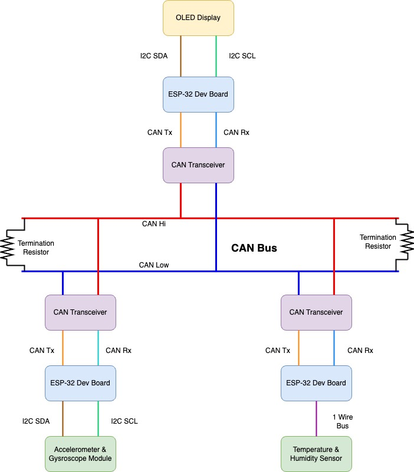

# CAN Bus Messaging

A simple project which demonstrates communication of 3 CAN nodes over a CAN bus.

## CAN Nodes

This project consists of three CAN nodes.

- Display Node
- Temperature and Humidity data collector Node
- Accelerometer and Gyroscope data collector Node

## Building

All three projects are based on ESP-32 microcontroller. They can be built using ESP IDF build tool.
